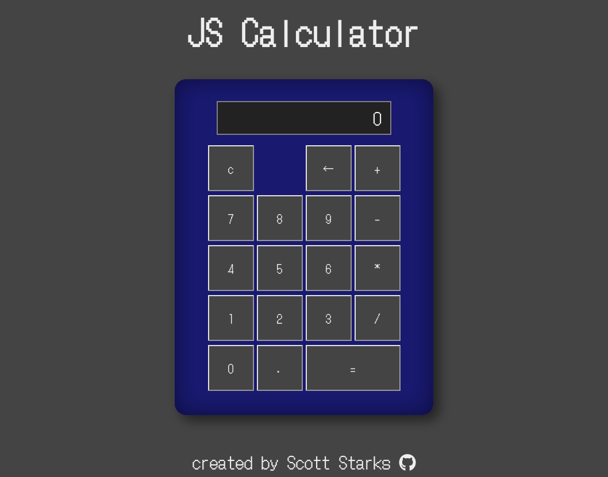

# Calculator

The project is the final assignment in the Foundations Course on [The Odin Project](https://www.theodinproject.com/).  The full assignment instructions can be found [here](https://www.theodinproject.com/lessons/foundations-calculator).

## Project

### Live Demo

Find a live demo of the project [here](https://thetramp22.github.io/calculator/).

### Screenshot



## Process

### Things I learned

I had a lot of trouble early in this project becaue I was stubbornly trying to make everything work inside of one or two large functions.  After some headache and some research I broke everything into smaller, easier to understand functions and progress went much smoother.

Update

After sharing my project on The Odin Project discord channel I was made aware that the display would overflow if you entered more than 18 digits.  I saw some other projects that seemed to use css to keep the overflow inside the box and hide it, but I figured that a calculator with such basic functions really didn't need to use numbers that large.  I made a fundtion in the script to limit the entries after 18 digits.

```
function display(toBeDisplayed) {
    currentDisplay.innerText = toBeDisplayed;
    if(currentDisplay.innerText.toString().length > 18) {
        currentDisplay.innerText = currentDisplay.innerText.toString().slice(0, -1);
    }
}

```

Big thanks to  user DreamVenerable in the discord channel for pointing that out.